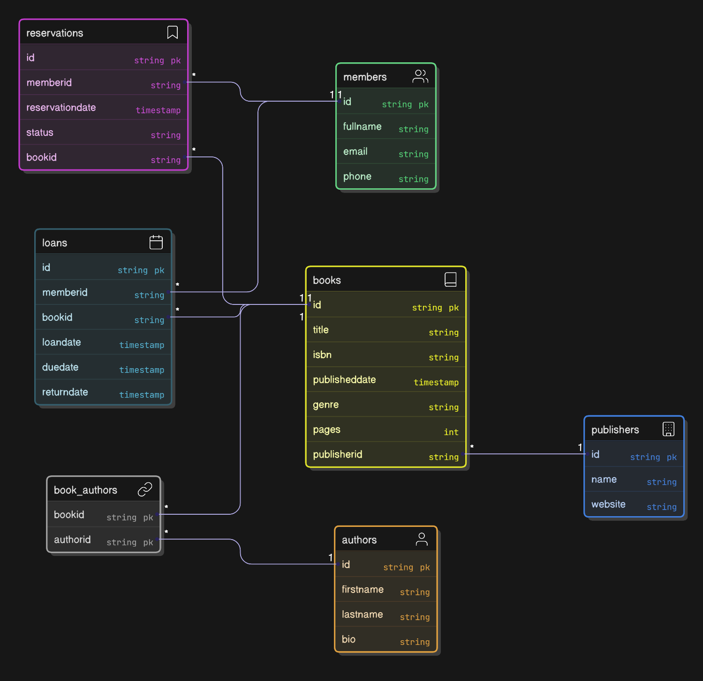

### Library Management App

A Library Management App built with C# using Asp.Net Core WebAPI.

## Features

- Manage multiple books, each with multiple authors and a publisher.

- Track book loans with loan and return dates.

- Handle book reservations with status tracking.

- Store member details for borrowing and reserving books.

## Entity Relationships

## Tech Stack

- Language: C#

- Framework: Asp .NET Core

- Architecture: Layered Architecture

© Hamid — 2025
